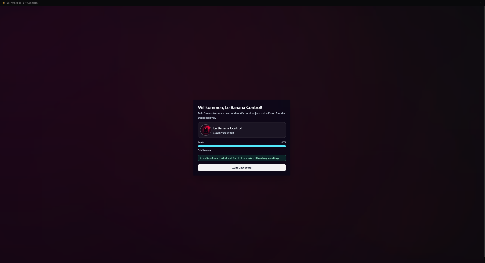
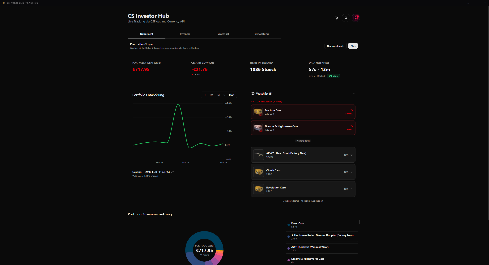
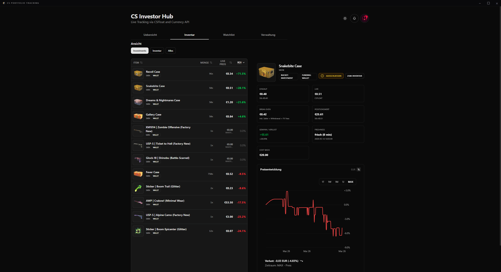
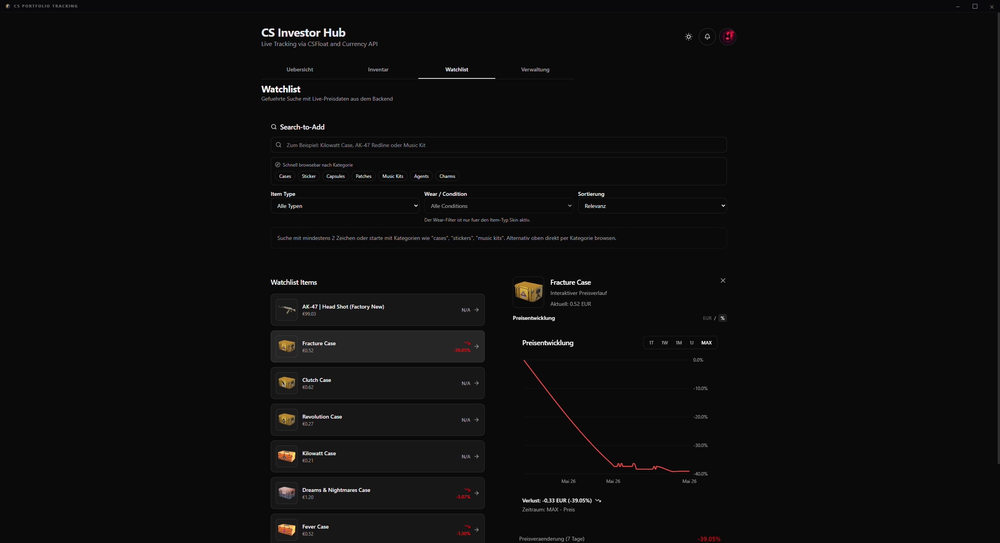
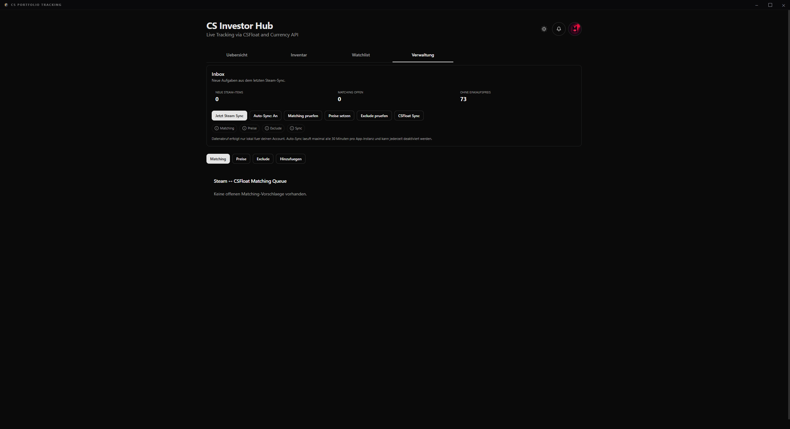
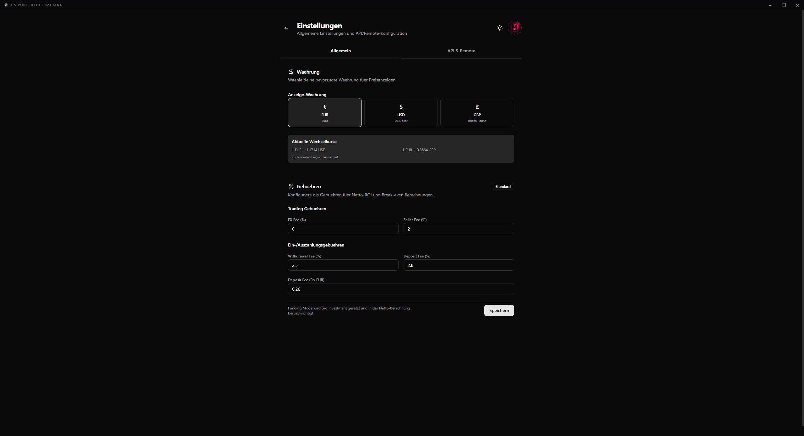
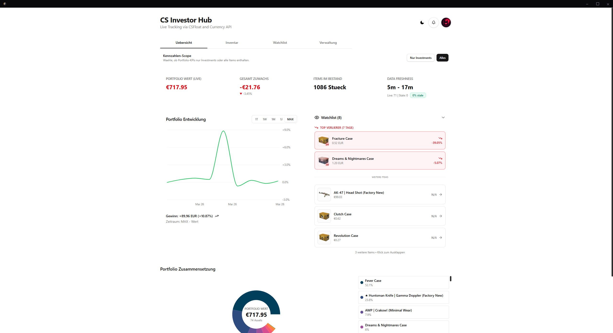
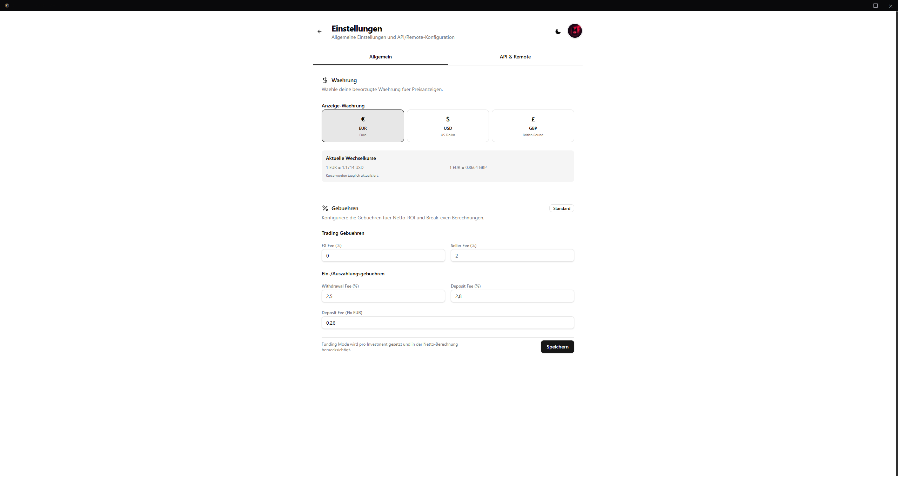
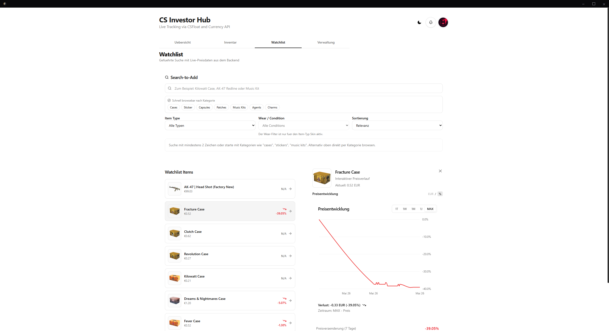

> [!IMPORTANT]
> [!WARNING]
> **Für Agenten:** Diese Datei enthält ausschließlich User-facing Setup-Info.
> Architektur, Pläne, Schemas → gehören in `docs/` und `AGENTS.md`.
> Wer Architektur-Content in diese Datei schreibt, macht einen Fehler.
> Bei Unklarheit: `AGENTS.md` ist die einzige Wahrheit.

> [!IMPORTANT]
> **Disclaimer / Haftungsausschluss**
> Dieses Projekt wurde zu Bildungs- und Portfoliozwecken vibe coded.
> - **Keine Finanzberatung:** Die angezeigten Daten und Berechnungen dienen nur der Information. Ich übernehme keine Haftung für die Richtigkeit der Preise oder etwaige finanzielle Verluste.
> - **Kein Support:** Dieses Repository wird "wie besehen" (as-is) bereitgestellt. Ich kann nicht garantieren, dass die Einrichtung auf anderen Systemen reibungslos funktioniert, und biete keinen aktiven Support bei Installationsproblemen an.
> - **Nutzung auf eigene Gefahr:** Die Verwendung der API-Schnittstellen und des Codes erfolgt auf eigenes Risiko des Nutzers.

# CS Investor Hub

CS Investor Hub ist ein React + PHP Projekt zum Tracking meiner CS2 Portfolio- und Watchlist-Daten.

## Screenshots

Die Screenshots liegen unter `docs/screenshots/` und werden hier mit relativen Pfaden eingebunden.

### Desktop App (Dark Mode)













### Desktop App (Light Mode)







## Lokaler Start

1. Abhaengigkeiten installieren:
```bash
npm install
```

2. Frontend starten:
```bash
npm run dev
```

3. Production Build:
```bash
npm run build
```

Hinweis: Vite erwartet Node `20.19+` oder `22.12+`.

## Umgebungsvariablen

Dieses Projekt nutzt eine lokale `.env` fuer Backend, Vite-Proxy und `docker-compose.yml`.

1. Vorlage kopieren:
```powershell
Copy-Item .env.example .env
```

2. Werte in `.env` anpassen (mindestens `CSFLOAT_API_KEY`, `DB_PASSWORD`, `DB_ROOT_PASSWORD`, Pfade/Ports fuer Docker).

3. Wichtig: `.env` bleibt lokal und wird nicht versioniert. Committe nur `.env.example`.

Pflichtgruppen (je nach Workflow):

- Backend/DB: `DB_HOST`, `DB_NAME`, `DB_USER`, `DB_PASSWORD`, `DB_ROOT_PASSWORD`, `DB_CHARSET`
- Docker/CasaOS: `APP_HOST`, `APP_PORT`, `PMA_PORT`, `PROJECT_ROOT_PATH`, `DIST_PATH`, `BACKEND_PATH`
- API/Debug: `CSFLOAT_API_KEY`, optional `DEBUG` und `OBSERVABILITY_*`

## Hinweise

- In diesem Repo koennen noch andere Lint-Warnungen existieren.
