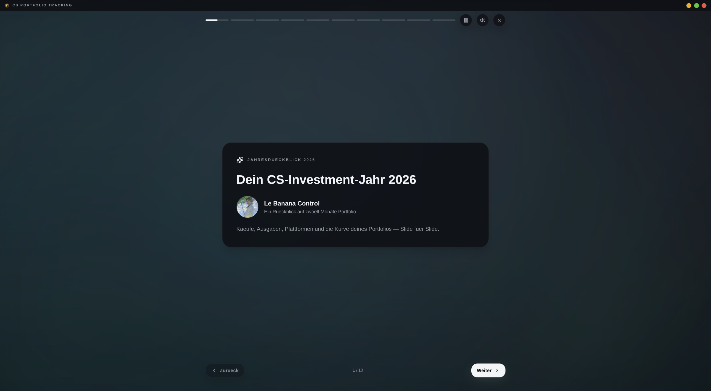
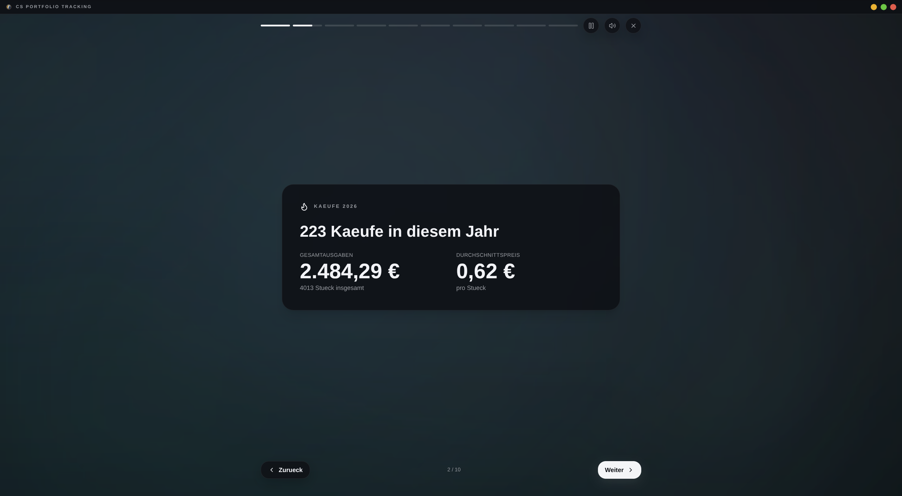
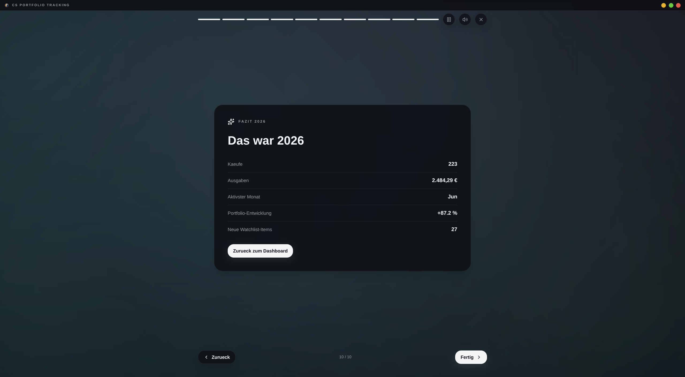
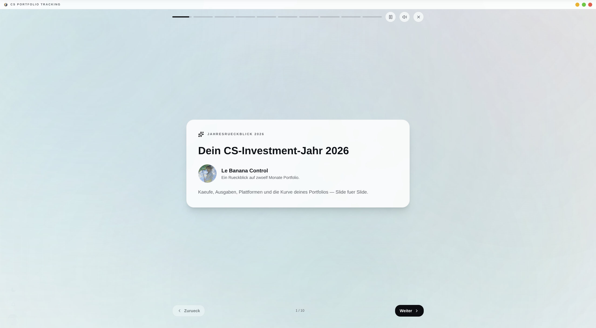

# CS Tracking

## Video
Tried Claude with Remotion for this one:
<video src="https://github.com/user-attachments/assets/18241488-2846-4a69-b66b-c7e0f512bfd3"></video>

## Installation / Setup

1. Install dependencies:
```bash
npm install
```

2. Create a local env file:
```bash
cp .env.example .env
```
On Windows PowerShell:
```powershell
Copy-Item .env.example .env
```

3. Fill in `.env` (at minimum the relevant DB and API values).

## npm run Commands

```bash
npm run dev
npm run build
npm run build:linux
npm run build:web
npm run lint
npm run docs:guard
npm run i18n:guard
npm run rebuild:desktop-native
```

## Desktop Builds

Builds run on the target operating system (electron-builder detects the platform
automatically). The native module `better-sqlite3` is recompiled for that platform
during the build.

### Windows

```bash
npm run build
```

Produces the NSIS installer (`CS-Investor-Hub-Setup-*.exe`) in `release/`.

### Linux (AppImage + .deb)

```bash
npm run build:linux
```

Produces in `release/`:
- `CS-Investor-Hub-*.AppImage` — portable, no installation. Make it executable and run it:
  ```bash
  chmod +x release/CS-Investor-Hub-*.AppImage && ./release/CS-Investor-Hub-*.AppImage
  ```
  On Ubuntu 24.04 / Zorin OS 18 you may need `sudo apt install libfuse2t64` (only to run it, not to build it).
- `CS-Investor-Hub-*.deb` — for Debian/Ubuntu-based distros (including Zorin OS 18):
  install via `sudo apt install ./release/CS-Investor-Hub-*.deb`.

**No system PHP required (Windows & Linux):** the PHP backend (sidecar) ships as a
statically linked runtime. The build scripts run `npm run fetch:php`, which downloads a
prebuilt static PHP binary (with `curl`, `openssl`, `mbstring`, `sqlite3`, `pdo_sqlite`)
plus a CA bundle (`cacert.pem`) from static-php.dev into `resources/php/<platform>/`;
electron-builder embeds it per platform via `extraResources`. The binaries are
deliberately not in git (see `.gitignore`) and are fetched on every build.

If the app fails to start with a `better-sqlite3` ABI error, rebuild the native modules
against the Electron ABI:

```bash
npm run rebuild:desktop-native
```

### CI

`.github/workflows/desktop-release.yml` builds Windows and Linux artifacts on a `v*` tag
and attaches them to the GitHub release.

## Screenshots





